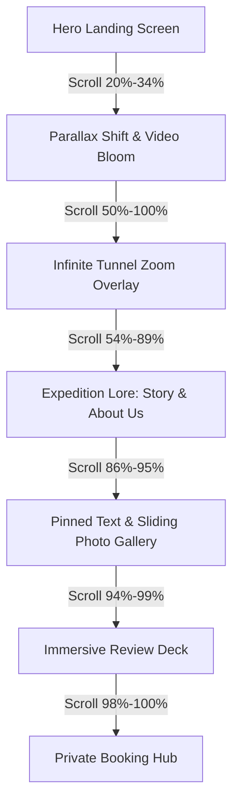

# 🏔️ Heart of the Mountain — Interactive Narrative Clone

[](https://react.dev/)
[](https://www.typescriptlang.org/)
[](https://vite.dev/)
[](https://tailwindcss.com/)
[](https://motion.dev/)

An immersive, cinematic, scroll-driven storytelling web portal built with **React 19**, **Vite**, **TypeScript**, **Tailwind CSS v4**, and **Framer Motion**. This project is a highly-polished, educational clone inspired by the official *Heart of the Mountain* real-life immersive puzzle adventure located in Marrickville, Sydney.

---

## 📽️ Experience Overview

This application recreates the premium, dark editorial narrative of a remote expedition. Users scroll down a continuous **7600vh** timeline, transitioning seamlessly through custom, timed animation phases:



---

## ✨ Core Features

### 🎬 1. Cinematic Scroll Orchestration (`Hero.tsx`)
A monolithic, masterfully-timed scroll tracking system that converts scroll values (`scrollYProgress`) into precise, smooth-spring transitions using custom-defined phases.
*   **Video Bloom Transition**: A synchronized CSS circular mask (`clip-path: circle()`) blooms dynamically as the user scrolls, introducing raw action clips.
*   **Infinite Tunnel Zoom**: Parallel background image layers scale sequentially with half-cycle offsets to generate a seamless, scroll-driven infinite tunnel dive.
*   **Parallax Text Drift**: Headers, icons, and badges drift out of view with custom scaling and blurring values.

### 🎵 2. Immersive Soundscapes (`useBackgroundAudio.ts`)
A custom hook built on top of **Howler.js** that implements realistic soundscapes with optimal performance:
*   **Crossfade Fading**: Audio fades in gradually when initialized and transitions smoothly to `0` volume when paused, preventing harsh audio cuts.
*   **HTML5 Audio Streams**: Utilizes HTML5 audio streaming to minimize memory usage for large music files.
*   **Robust Lifecycle Hook**: Auto-unloads assets during unmounting and cleanly handles loading, ready, pausing, and error states.

### 🖼️ 3. Sliding Story Showcase
*   **Horizontal Photo Carousel**: A modular image strip (`GALLERY_IMG`) sweeps horizontally across the screen while the central quote remains pinned, simulating a physical walk-through.
*   **Interactive Modal**: A luxurious overlay modal loaded with background locks, smooth entry triggers, and responsive grids revealing deep lore archives.

### 📅 4. Premium Booking Deck (`Book.tsx`)
*   **Dynamic Pricing Tiers**: Layout designed to showcase session availability, group recommendations, and interactive pricing metrics.
*   **Advisory Guidance**: Clean, clear sections advising players on age requirements, accessibility options, and gameplay prerequisites.

---

## 🛠️ Technology Stack

| Technology | Purpose | Key Implementation |
| :--- | :--- | :--- |
| **React 19** | UI Layer | Functional components, state management, global anchors |
| **TypeScript 6** | Safety | Explicit types, strict config (`tsconfig.json`) |
| **Tailwind CSS v4** | Styling | Lightning-fast utilities, custom `@theme` variables |
| **Motion (`motion/react`)** | Animation | `useScroll`, `useTransform`, `useSpring`, `AnimatePresence` |
| **Howler.js** | Audio | Loop streams, background crossfades, volume clamping |
| **Vite 8** | Dev Tooling | Hot Module Replacement (HMR), static asset optimization |

---

## 📂 Project Architecture

```bash
heart-of-mountain/
├── src/
│   ├── assets/               # Local static assets, logos, and sounds
│   ├── hooks/
│   │   └── useBackgroundAudio.ts # Custom Howler.js hook with fade/loading controls
│   ├── components/
│   │   ├── Header.tsx        # Navigation bar with responsive links & state tracking
│   │   ├── Hero.tsx          # Master scroll-phase orchestrator
│   │   ├── Story.tsx         # Act I: Alice Ivy's expedition lore
│   │   ├── AnswerCall.tsx    # Act II: Call to adventure copy
│   │   ├── AboutUs.tsx       # Act III: Hazel & Ivy dialogue portal
│   │   ├── AboutUsModal.tsx  # Deep-dive full-screen interactive overlay
│   │   ├── Review.tsx        # Act IV: Cinematic quote deck
│   │   ├── Book.tsx          # Act V: Interactive Booking briefing
│   │   ├── FAQs.tsx          # Collapsible FAQ accordion cards
│   │   ├── Contact.tsx       # Newsletter form, social widgets, and footer credits
│   │   └── heroScrollPhases.ts # Numerical scroll-phase landmarks (0.0 - 1.0)
│   ├── App.tsx               # Global scroll anchor listeners & layout assembler
│   ├── index.css             # Tailwind imports & custom font loading
│   └── main.tsx              # React entry root
├── public/                   # Public static videos, fonts, and assets
├── package.json              # App metadata and library dependencies
└── vite.config.ts            # Vite build instructions & Tailwind plugin configuration
```

---

## 🚀 Getting Started

Follow these instructions to set up the project locally on your machine.

### Prerequisites

Make sure you have [Node.js](https://nodejs.org/) (v18+) and [npm](https://www.npmjs.com/) installed.

### Installation

1. **Clone the repository:**
   ```bash
   git clone https://github.com/your-username/heart-of-mountain.git
   cd heart-of-mountain
   ```

2. **Install dependencies:**
   ```bash
   npm install
   ```

3. **Start the development server:**
   ```bash
   npm run dev
   ```

4. **Build for production:**
   ```bash
   npm run build
   ```

5. **Preview the production build:**
   ```bash
   npm run preview
   ```

---

## 🧬 Highlight: Scroll Phase Architecture

To coordinate complex animations smoothly on a single scroll timeline, the project divides the height into landmarks inside [`heroScrollPhases.ts`](file:///Users/wenni/Desktop/react/kpi_2026/heart-of-mountain/src/components/heroScrollPhases.ts):

```typescript
export const SCROLL_PHASE = {
  heroHoldEnd: 0.2,       // Hero title stops holding
  heroExitEnd: 0.34,      // Hero elements fully dissolved
  videoStart: 0.24,       // Video clipping blooms open
  videoHoldEnd: 0.47,     // Video holds maximum size
  videoEnd: 0.54,         // Video fully dissolved
  tunnelStart: 0.5,       // Tunnel zoom overlay starts
  storyStart: 0.54,       // Expedition Story fades in
  aboutStart: 0.79,       // About Us section staggers in
  quoteStart: 0.865,      // Main quote lifts up
  reviewStart: 0.945,     // Review panels scale up
  bookStart: 0.988,       // Final booking form anchors
} as const;
```

These parameters allow standard components to interpolate their opacity, scaling, and coordinates seamlessly based on the global spring progress `sp`.

---

## 📝 Disclaimer & Credits

*   **Disclaimer**: This is a non-commercial clone built solely for educational and portfolio demonstration purposes. All rights, graphic assets, media, and design concepts belong to the original creators of **Heart of the Mountain**. No copyright infringement is intended.
*   **Author**: Built with ❤️ by [Wen Ni Lim](https://www.linkedin.com/in/lim-w-857166229/).
